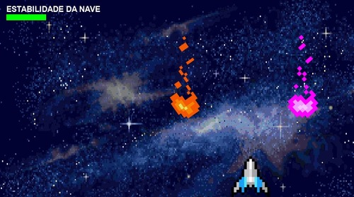

# Milkway


Logo do jogo Milkway. Asteroides de múltiplas cores vibrantes voam pelo espaço estrelado ao lado da austera nave do jogador em frente a um planeta brilhante e desconhecido. O planeta terra aparece, ao fundo, no canto, distante e pequeno. A imponente logo "MILKWAY", situa-se entre os demais componentes da imagem, centralizada.

## Jogo acessível com pygame :sunglasses:

:milky_way: milkway :rocket: Em desenvolvimento :milky_way:

### Ideia do Jogo

Pensando nas dificuldades que muitos deficientes visuais têm em participar de jogos digitais, nós pensamos em um jogo totalmente inclusivo com recursos sonoros para nortear as ações do jogador. Por meio do som, o usuário consegue saber o que fazer e para onde ir, característica que o torna acessível para pessoas cegas ou que tenham algum tipo de limitação visual, além de possuir artifícios gráficos para as pessoas sem nenhuma dificuldade visual. O jogo conta também com técnicas de sonorização holofônica,  para simular o som em três dimensões. Este efeito sonoro traz uma sensação de áudio em 360°, o que permite, apenas pelo som, localizar o jogador e os obstáculos. Durante o jogo, é preciso ficar atento na origem e intensidade dos  alarmes que a nave emite para saber onde e quão perto os asteroides estão. Além de ajudar na localização, a sonorização 3D ainda promove uma maior imersão no jogo. 

Para que a experiência seja completa, é imprescindível o uso de fones de ouvido.

#### Tela do jogo. 

Asteroides de múltiplas cores vibrantes voam pelo espaço estrelado indo em direção a uma nave. Barra de vida no canto superior esquerdo logo abaixo da frase “Estabilidade da nave”.

### Pré-requisitos :heavy_check_mark:

Antes de começar a jogar você precisa ter instalado:
[Python](https://www.python.org/), [Git](https://git-scm.com/).

### Rodando o jogo :video_game:

```bash
# Clone o repositorio
$ git clone https://github.com/TP-Coltec-UFMG/milkway

# Acesse o diretorio
$ cd milkway

# Instale as dependencias
$ pip install -r requirements.txt

# Execute milkway.py
$ python milkway.py
```

### Autores :pencil2:
[Amanda](https://github.com/Fiaux12),
[Eric](https://github.com/mifegui),
[Erick](https://github.com/erickRochaIP),
[Marcela](https://github.com/MDonata)
